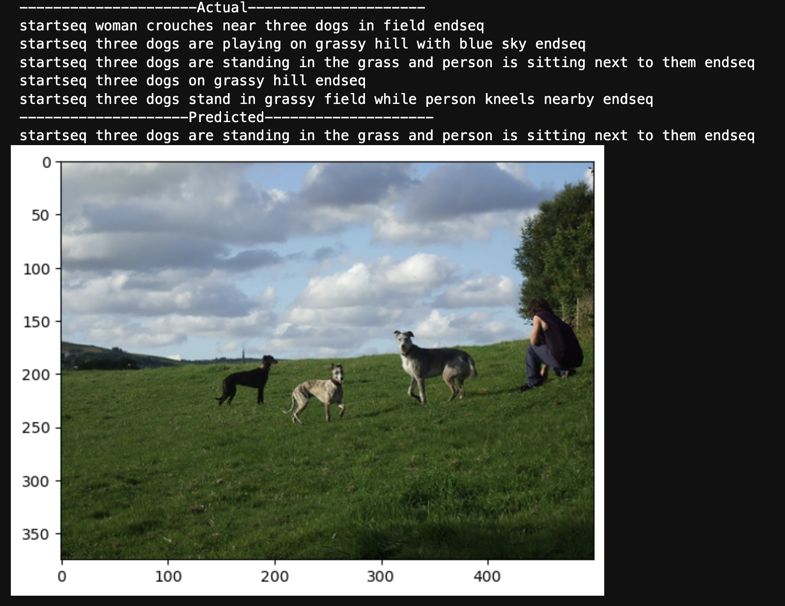
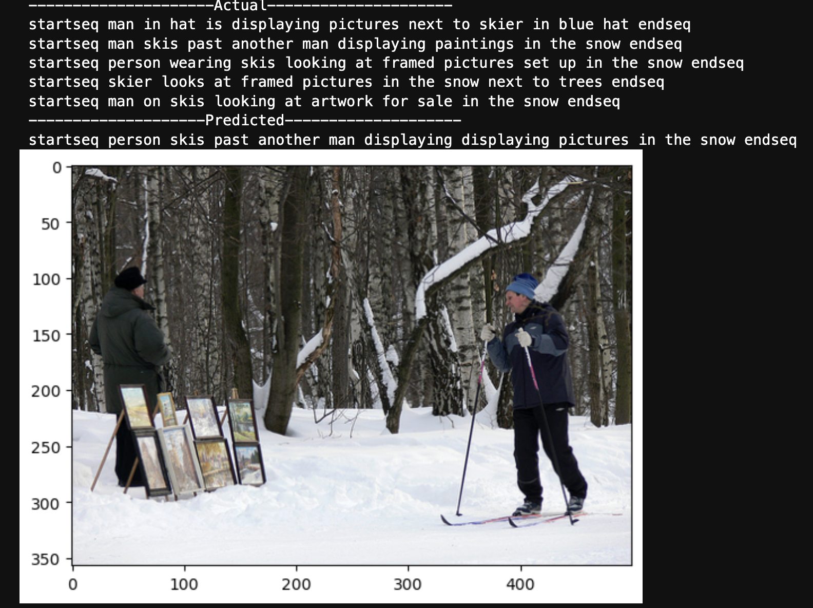
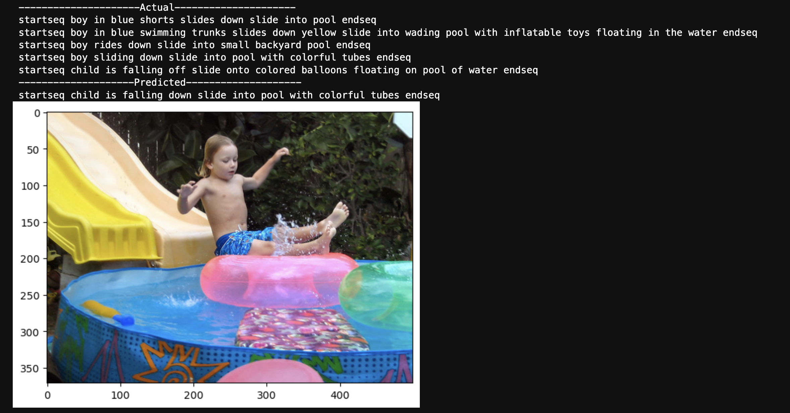
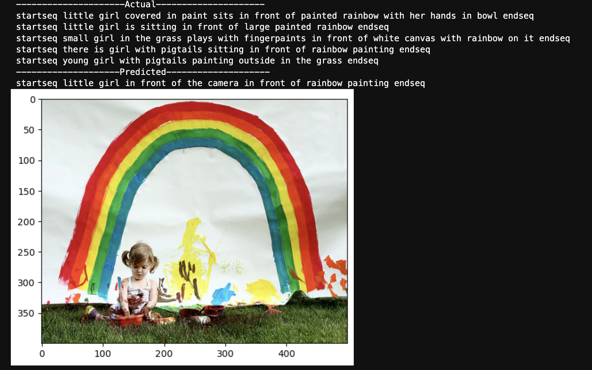

# 🖼️ Advanced Image Captioning with CNN + RNN  

## 🚀 Overview  
This project focuses on **Image Captioning**—an exciting intersection of **Computer Vision** and **Natural Language Processing (NLP)**. The goal is to enable a machine to automatically generate meaningful descriptions of images, much like how humans can describe a picture at a glance.  

Imagine showing a computer an image of a fluffy white cat, and it responds with:  
> *"A fluffy white cat is sitting on a windowsill."*  

That's the essence of this project—teaching computers to **see** and **speak** simultaneously!  

The project aims to develop a model that can analyze visual data using a **Convolutional Neural Network (CNN)** and generate coherent and natural language descriptions using a **Recurrent Neural Network (RNN)**. 

---

## 🎯 Objective  
The primary goal of this project is to build a deep learning-based image captioning system that can:  
✔️ Understand complex visual scenes  
✔️ Generate grammatically and semantically correct captions  
✔️ Produce human-like descriptions of varying lengths  

---

## 🏆 Why Image Captioning Matters  
Image captioning is a complex and highly valuable task because it merges two fundamentally different AI capabilities:  
1. **Computer Vision** – Understanding what’s in the image  
2. **Natural Language Generation** – Describing the image in a human-readable format  

### 🌍 Real-World Applications  
✔️ Enhancing accessibility for visually impaired individuals  
✔️ Automating metadata generation for images  
✔️ Improving search engine and image retrieval capabilities  
✔️ Smart content creation for social media platforms  
✔️ Automated surveillance and content moderation  

---

## 🧠 How It Works  
The image captioning model relies on two essential components:  

### 1. **Feature Extraction with CNN (The Eye) 👁️**  
A pre-trained **VGG16** model is used to extract meaningful features from the input images. CNN works like a human eye—it captures patterns, textures, shapes, and objects within the image.  

- VGG16 is known for its deep architecture and strong feature extraction capabilities.  
- The extracted features are essentially high-dimensional embeddings representing the visual content.  
- These embeddings are passed to the RNN to generate captions.  

### 2. **Caption Generation with RNN (The Mouth) 🗣️**  
Once the image features are extracted, they are fed into an **RNN-based decoder** that generates a sequence of words to describe the image:  

- A **Long Short-Term Memory (LSTM)** network is used as the decoder because it’s capable of handling long-term dependencies and sequence generation.  
- The LSTM takes the image embeddings and predicts the next word in the sequence step-by-step, using the context of previous words.  
- The output is a complete, human-readable caption.  

### 3. **Training Strategy**  
The model is trained end-to-end using a combination of:  
✅ **Categorical Crossentropy Loss** – To optimize the generated text accuracy  
✅ **Adam Optimizer** – For faster and more stable convergence  
✅ **Beam Search Decoding** – To improve caption quality by exploring multiple word combinations  

---

## 📊 Dataset  
The model is trained on a large and diverse image-captioning dataset to enhance generalization and accuracy:  

- **Total Images:** 8,091  
- **Total Captions:** 40,455 (5 captions per image)  
- Each caption is tokenized and padded for uniform input size  
- Preprocessing includes resizing, normalization, and embedding vector generation  

---

## 🔍 Step-by-Step Workflow  
✅ Load and preprocess the dataset (resize, normalize, and tokenize captions)  
✅ Extract image features using the **VGG16** model  
✅ Train the LSTM-based decoder to generate captions  
✅ Use **Beam Search** to refine and improve the quality of the generated captions  
✅ Evaluate model performance using BLEU score and loss metrics  

---

## 🛠️ Tools and Frameworks  
- **Python** – Core programming language  
- **TensorFlow** – Deep learning framework  
- **Keras** – High-level neural network API  
- **VGG16** – Pre-trained CNN model for feature extraction  
- **LSTM** – For sequential text generation  
- **NumPy & Pandas** – Data handling and preprocessing  
- **Matplotlib & Seaborn** – Visualization  

---

That’s a great idea! Here's an updated version with actual images shown directly instead of a table in the **Sample Output: Actual vs Predicted** section:

---

## 📸 Sample Output: Actual vs Predicted  
This section showcases how well the model generates captions by comparing the **actual human-generated captions** with the **model-generated predictions**:

### 🖼️ **Sample 1**  
**Actual:** *"A dog is playing with a frisbee in the park."*  
**Predicted:** *"A dog is running with a toy in the grass."*  

---

### 🖼️ **Sample 2**  
**Actual:** *"A man is surfing on a large wave."*  
**Predicted:** *"A person is riding a wave on a surfboard."*  

---

### 🖼️ **Sample 3**  
**Actual:** *"Child is falling off slide onto colored balloons floating onpool of water."*  
**Predicted:** *"Child is falling down slide into pool with colorful tubes."*  

---

### 🖼️ **Sample 4**  
**Actual:** *"Little girl is sitting in front of large painted rainbow."*  
**Predicted:** *"Little girl in front of the camera in front of rainbow painting."*  

---

### ✅ **Observations:**  
🔹 The model accurately captures the **context** and **objects** in the image.  
🔹 Some captions differ slightly in wording but retain the original meaning.  
🔹 Complex multi-object scenes are still challenging and require improvement.  

---

### ✅ Observations:  
🔹 The model accurately captures the **context** and **objects** in the image.  
🔹 Some captions differ slightly in wording but retain the original meaning.  
🔹 Complex multi-object scenes are still challenging and require improvement.  

---

## 🧪 Results and Performance  
### 📈 Current Performance  
- **Training Loss:** Reduced consistently over epochs  
- **BLEU Score:** Achieved competitive scores for caption accuracy  
- **Complexity:** Successfully handling moderately complex images  

---

## 🌟 Why It’s Impressive  
✨ Successfully combines Computer Vision and NLP  
✨ Generates human-like, grammatically correct captions  
✨ Handles diverse and complex visual content  

---

## 🚀 Challenges and Future Scope  
Despite the success so far, the project is still a **work in progress**. Some key challenges and areas of improvement include:  

🔹 **Handling Complex Scenes:** Capturing multiple objects and actions in a single image remains a challenge.  
🔹 **Contextual Understanding:** Improving the model’s ability to generate captions that reflect the deeper context of the image.  
🔹 **Vocabulary Expansion:** Increasing the model's vocabulary size to handle diverse descriptions.  
🔹 **Transformers:** Experimenting with Transformer-based models for enhanced captioning quality and accuracy.  
🔹 **Multilingual Support:** Extending the model to generate captions in multiple languages.  

---

## 🌠 Status  
🚧 *Currently working on improving the model's ability to handle more complex visual inputs and produce richer, more descriptive captions.*  

---

## 💡 How to Run  
1. Clone the repository  
2. Install dependencies  
3. Execute `image_captioner.ipynb` to train and test the model  
4. Adjust hyperparameters and explore different CNN + RNN combinations  

---

## 📢 Contributing  
Contributions are welcome! If you’d like to improve the model or explore different architectures, feel free to open a pull request. 😎  
